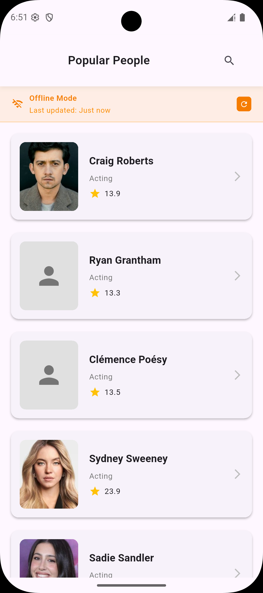
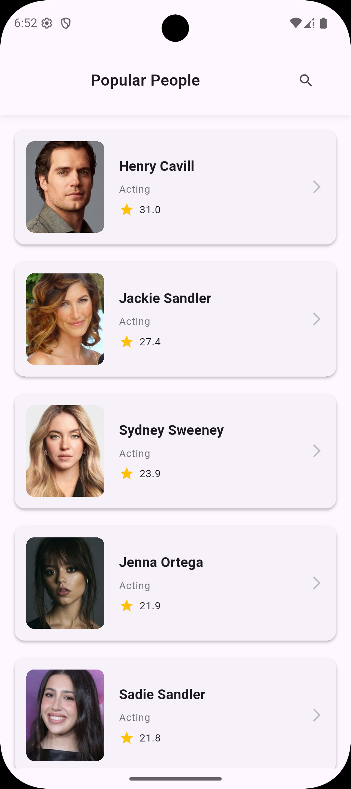
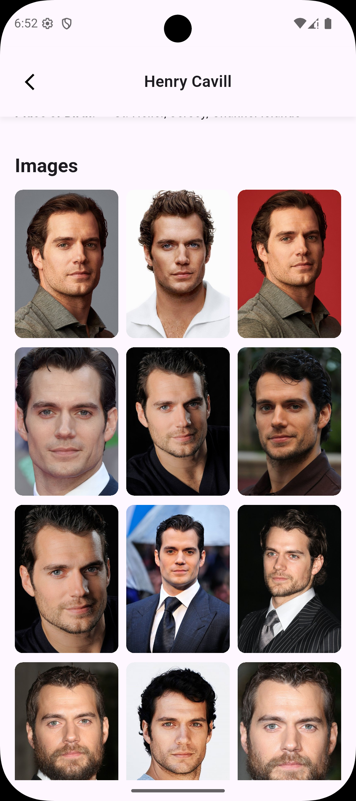

# 🎬 TMDB Popular People - Flutter App

A modern, production-ready Flutter application that showcases popular people from The Movie Database (TMDB) API with comprehensive details, image galleries, and offline support.

## 📺 App Demo

### 🎥 Video Showcase

<!-- App Demo Video -->
https://github.com/OmarAbdelazeem/Axis_Task/blob/main/output.webm

*📱 Watch the app in action - showcasing popular people browsing, detailed views, and image galleries*

### 📱 Screenshots

<div align="center">
  <table>
    <tr>
      <td align="center">
        
        <br/>
        <sub><b>Home Screen</b></sub>
      </td>
      <td align="center">
        
        <br/>
        <sub><b>Popular People List</b></sub>
      </td>
      <td align="center">
        
        <br/>
        <sub><b>Person Details</b></sub>
      </td>
    </tr>
    <tr>
      <td align="center">
        
        <br/>
        <sub><b>Image Gallery</b></sub>
      </td>
      <td align="center">
        
        <br/>
        <sub><b>Image Viewer</b></sub>
      </td>
      <td align="center">
        <!-- Placeholder for future screenshot -->
        <div style="width: 200px; height: 300px; background: #f0f0f0; display: flex; align-items: center; justify-content: center; border-radius: 8px;">
          <span style="color: #666;">More Features</span>
        </div>
        <br/>
        <sub><b>More Features</b></sub>
      </td>
    </tr>
  </table>
</div>

## 📱 Features

### 🌟 Core Features
- **Popular People List** - Browse trending personalities from TMDB
- **Person Details** - Comprehensive information including biography, birth details, and career info
- **Image Galleries** - High-quality photo collections for each person
- **Search Functionality** - Real-time search with filtering capabilities
- **Offline Support** - Cached data ensures app works without internet
- **Image Download** - Save person photos directly to device gallery
- **Pull-to-Refresh** - Easy data refresh with visual feedback
- **Pagination** - Efficient loading of large datasets

### 🎨 UI/UX Features
- **Responsive Design** - Adapts to all screen sizes and orientations
- **Dark Mode Support** - Seamless light/dark theme switching
- **Smooth Animations** - Polished transitions and loading states
- **Error Handling** - User-friendly error messages with retry options
- **Loading States** - Beautiful shimmer effects and progress indicators

## 🏗️ Architecture

This project follows **Clean Architecture** principles with a **feature-based** folder structure:

### 📁 Project Structure
```
lib/src/
├── 🎯 core/                    # Shared utilities and configurations
│   ├── helper/                 # Helper functions and utilities
│   ├── network/               # Network layer (Dio, interceptors, error handling)
│   ├── router/                # Navigation and routing
│   ├── styles/                # App themes and styling
│   └── utils/                 # Core utilities (DI, logging, validators)
├── 🎬 features/               # Feature modules
│   ├── intro/                 # Onboarding and splash
│   └── popular_people/        # Main feature - Popular People
│       ├── 🎯 domain/         # Business logic layer
│       │   ├── models/        # Domain entities
│       │   ├── repositories/  # Repository contracts
│       │   └── usecases/      # Business use cases
│       ├── 📊 data/           # Data access layer
│       │   ├── models/        # Data models (Hive, API)
│       │   ├── repositories/  # Repository implementations
│       │   └── data_sources/  # Local & Remote data sources
│       └── 🎨 presentation/   # UI layer
│           ├── bloc/          # State management (BLoC)
│           ├── pages/         # Screen widgets
│           └── widgets/       # Reusable UI components
└── 🔄 shared/                 # Shared UI components
    └── presentation/          # Common widgets and pages
```

### 🧩 Architecture Layers

#### 🎯 Domain Layer (Business Logic)
- **Pure Dart** - No Flutter or external dependencies
- **Use Cases** - Encapsulate business rules and logic
- **Entities** - Core business models
- **Repository Contracts** - Abstract interfaces for data access

#### 📊 Data Layer (External Concerns)
- **Repository Implementations** - Concrete data access implementations
- **Data Sources** - Remote (API) and Local (Hive) data handling
- **Data Models** - API responses and local storage models
- **Error Handling** - Network exceptions and failure types

#### 🎨 Presentation Layer (UI)
- **BLoC State Management** - Reactive UI with clear separation
- **Pages** - Screen-level widgets
- **Widgets** - Reusable UI components
- **Responsive Design** - Adaptive layouts for all devices

## 🛠️ Technical Stack

### 📦 Core Dependencies
- **Flutter SDK** - Cross-platform mobile development
- **Dart 3.8+** - Modern language features and null safety

### 🏗️ Architecture & State Management
- **flutter_bloc** - Reactive state management
- **get_it** - Dependency injection container
- **dartz** - Functional programming (Either, Option)
- **equatable** - Value equality without boilerplate

### 🌐 Networking & API
- **dio** - HTTP client with interceptors
- **cached_network_image** - Efficient image caching
- **connectivity_plus** - Network connectivity monitoring

### 💾 Local Storage
- **hive** - Fast, lightweight NoSQL database
- **hive_flutter** - Flutter integration for Hive
- **permission_handler** - Device permissions management

### 🎨 UI & Design
- **flutter_screenutil** - Responsive design utilities
- **photo_view** - Zoomable image viewer
- **pull_to_refresh** - Pull-to-refresh functionality
- **shimmer** - Loading skeleton animations

### 🖼️ Image & Media
- **gallery_saver_plus** - Save images to device gallery
- **flutter_svg** - SVG image support

### 🧪 Testing & Development
- **flutter_test** - Unit and widget testing
- **mockito** - Mocking framework
- **build_runner** - Code generation
- **device_preview** - Multi-device testing

## 🚀 Getting Started

### ⚙️ Prerequisites
- **Flutter SDK** (3.8.0 or higher)
- **Dart SDK** (3.8.0 or higher)
- **Android Studio** or **VS Code** with Flutter extensions
- **Android device/emulator** or **iOS device/simulator**

### 📋 Installation

1. **Clone the repository**
   ```bash
   git clone <repository-url>
   cd axis_task
   ```

2. **Install dependencies**
   ```bash
   flutter pub get
   ```

3. **Generate code** (if needed)
   ```bash
   flutter packages pub run build_runner build --delete-conflicting-outputs
   ```

4. **Run the app**
   ```bash
   flutter run
   ```

### 🔑 API Configuration

This app uses The Movie Database (TMDB) API. The API key is already configured in the project constants.

For production use, consider:
- Moving API keys to environment variables
- Implementing proper API key management
- Setting up different keys for development/production

## 🧪 Testing

### Run Tests
```bash
# Run all tests
flutter test

# Run tests with coverage
flutter test --coverage

# Run specific test file
flutter test test/features/popular_people/domain/usecases/get_popular_people_usecase_test.dart
```

### 📊 Test Coverage
- **68 Unit Tests** covering domain and data layers
- **Use Cases** - Complete business logic testing
- **Repositories** - Data access layer testing
- **Core Utilities** - Helper function testing

### 🎯 Testing Strategy
- **Domain Layer** - Pure unit tests with manual mocks
- **Data Layer** - Repository and data source testing
- **Core Utilities** - Helper and utility function testing
- **Manual Mocking** - Simple, maintainable test doubles

## 🏗️ Build & Deployment

### 🤖 Android
```bash
# Debug build
flutter build apk --debug

# Release build
flutter build apk --release

# App Bundle (recommended for Play Store)
flutter build appbundle --release
```

### 🍎 iOS
```bash
# Debug build
flutter build ios --debug

# Release build
flutter build ios --release
```

## 📝 Code Generation

This project uses code generation for:
- **JSON Serialization** - Model serialization/deserialization
- **Hive Type Adapters** - Local storage object adapters

To regenerate code:
```bash
flutter packages pub run build_runner build --delete-conflicting-outputs
```

## 🎨 Design Patterns Used

### 🏗️ Architectural Patterns
- **Clean Architecture** - Separation of concerns across layers
- **Repository Pattern** - Abstract data access
- **Use Case Pattern** - Encapsulated business logic
- **BLoC Pattern** - Reactive state management

### 🔧 Design Patterns
- **Dependency Injection** - Loose coupling and testability
- **Factory Pattern** - Object creation via DI container
- **Observer Pattern** - Reactive UI updates
- **Strategy Pattern** - Multiple data sources (local/remote)

## 📱 Supported Platforms

- ✅ **Android** (API 21+)
- ✅ **iOS** (iOS 11+)
- ✅ **Phone & Tablet** layouts
- ✅ **Portrait & Landscape** orientations

## 🔒 Permissions

### Android
- **Internet** - API data fetching
- **Network State** - Connectivity monitoring
- **Storage** - Image saving to gallery
- **Manage External Storage** - Android 11+ storage access

### iOS
- **Network** - API data fetching
- **Photo Library** - Image saving to Photos app

## 📈 Performance Features

- **Image Caching** - Automatic network image caching
- **Offline Support** - Hive local database for data persistence
- **Lazy Loading** - Efficient list rendering with ListView.builder
- **Memory Management** - Proper resource disposal and lifecycle management
- **Responsive Design** - Optimized layouts for all screen sizes

## 🐛 Error Handling

- **Network Errors** - Graceful handling with user-friendly messages
- **Cache Fallback** - Automatic fallback to local data when offline
- **Retry Mechanisms** - Easy retry options for failed operations
- **Logging** - Comprehensive logging for debugging

## 🔄 State Management

The app uses **BLoC (Business Logic Component)** pattern:
- **Events** - User actions and system events
- **States** - UI state representations
- **BLoC** - Business logic and state transitions
- **Reactive UI** - Automatic UI updates based on state changes

## 🤝 Contributing

1. Fork the repository
2. Create a feature branch (`git checkout -b feature/amazing-feature`)
3. Commit your changes (`git commit -m 'Add amazing feature'`)
4. Push to the branch (`git push origin feature/amazing-feature`)
5. Open a Pull Request

### 📋 Development Guidelines
- Follow **Clean Architecture** principles
- Write **unit tests** for business logic
- Use **BLoC pattern** for state management
- Maintain **code quality** with proper formatting
- Add **documentation** for new features

## 📄 License

This project is licensed under the MIT License - see the [LICENSE](LICENSE) file for details.

## 🙏 Acknowledgments

- **The Movie Database (TMDB)** - For providing the comprehensive movie and person data API
- **Flutter Team** - For the amazing cross-platform framework
- **Open Source Community** - For the excellent packages and libraries used

---


---

**Built with ❤️ using Flutter and Clean Architecture**
# Axis_Task
